<div align="center">
  
</div>

<div align="center">
  
  [](https://git.io/typing-svg)
  
  
  
  [](https://github.com/DevYuriTiago)
  [](https://linkedin.com/in/yuri-vasconcellos)
  
  
</div>

---

## 🚀 Sobre Mim


### 💡 O que o GPT disse sobre mim:

<details open>
<summary><b>🤖 Clique para expandir a análise completa</b></summary>
<br>

> *"Com base em todas as nossas interações até hoje, posso dizer que você é um profissional altamente **versátil e inovador**, com grande experiência em desenvolvimento de software, liderança técnica e automação. Seu foco principal é a criação de soluções **robustas e eficientes**, aplicando metodologias ágeis, padrões de arquitetura e boas práticas de programação."*

#### 🎯 Competências Principais:
- 💻 **Stack Técnico:** Flutter, C#, .NET, Python, SQL
- 🔄 **Automação:** n8n, Power Automate, Firebase
- 📱 **Desenvolvimento:** Web & Mobile de ponta a ponta
- 🤖 **IA Aplicada:** Finanças, Automações e Prompts
- 🎓 **Educação:** Plataformas de ensino online
- 🏗️ **Arquitetura:** Soluções escaláveis e seguras

#### 🌟 Perfil Profissional:
```python
class YuriVasconcellos:
    def __init__(self):
        self.role = "Tech Lead & Inovador"
        self.skills = ["Liderança Técnica", "Automação", "IA", "Educação"]
        self.mindset = ["Estratégico", "Inovador", "Organizado"]
        self.passion = "Transformar conhecimento em soluções práticas"
    
    def current_focus(self):
        return [
            "🎓 Plataforma de ensino online",
            "🔐 Soluções de segurança de conteúdo",
            "💰 Produtos digitais na Kiwify",
            "🤖 IA aplicada a negócios"
        ]
```

> *"Se eu pudesse resumir: você é um **líder técnico**, desenvolvedor experiente, **educador e inovador**, com um olhar estratégico para tecnologia e negócios."*

#### ✅ **Acho que ele acertou em cheio!**

</details>

---

## 📊 GitHub Analytics

<div align="center">
  
  
</div>

<div align="center">
  
</div>

<div align="center">
  
</div>

<div align="center">
  
</div>

---

## 💻 Tech Stack & Expertise

<div align="center">

### 🔥 Linguagens de Programação


### 🎨 Frontend Development


### ⚙️ Backend & Databases


### 🤖 AI & Automation


### 🛠️ DevOps & Tools


</div>

---

## 🌟 Projetos em Destaque

<div align="center">

<table>
<tr>
<td width="50%">

### 📖 Prompts 360
[](https://prompts360.com.br)

**Stack:** HTML, CSS, JavaScript  
**Highlights:**
- 🎨 Design responsivo e moderno
- ⚡ Performance otimizada
- 💰 Integração com plataformas de vendas
- 📱 Mobile-first approach

</td>
<td width="50%">

### 💈 DMens Barbearia
[](https://dmensbarbearia.netlify.app)

**Stack:** React, Netlify  
**Highlights:**
- 🎯 Captura de leads eficiente
- 📊 Analytics integrado
- 🎨 Interface atraente
- 📱 Totalmente responsivo

</td>
</tr>
</table>

</div>

---

## 📈 Contribuições & Atividade

<div align="center">
  
```ascii
  🟢 Comprometido com código limpo e boas práticas
  🚀 Sempre buscando inovação e melhoria contínua
  🎯 Foco em entregar valor real aos usuários
  🔄 Aprendizado constante e evolução técnica
```


</div>

---

## 🎯 Áreas de Especialização

```mermaid
%%{init: {'theme': 'forest', 'themeVariables': {
  'primaryColor': '#2563eb',
  'primaryBorderColor': '#1d4ed8',

  'secondaryColor': '#10b981',
  'secondaryBorderColor': '#059669',

  'tertiaryColor': '#9333ea',
  'tertiaryBorderColor': '#7e22ce',

  'fontSize': '16px'
}}}%%
mindmap
  root((Yuri Vasconcellos))
    Desenvolvimento
      Mobile Flutter
      Web React Vue.js
      Backend .NET Node Python
    Liderança
      Gestão de Times
      Arquitetura
      Code Review
    Automação
      n8n
      Power Automate
      Scripts Python
    IA & ML
      Prompts
      Integração APIs
      Finanças
    Educação
      Plataformas Online
      Mentoria
      Conteúdo Tech
```

<div align="center">



</div>

---

## 📫 Vamos Conectar?

<div align="center">
  
  [](https://www.linkedin.com/in/dev-yuri-tiago/)
  [](https://github.com/DevYuriTiago)
  [](mailto:yuri@example.com)
  [](https://prompts360.com.br)
  
</div>

---

## 💡 Quote do Dia

<div align="center">
  
  
  
</div>

---

## 🐍 Contribution Snake

<div align="center">
  
  
  
</div>

---

<div align="center">
  
  
  ### ⭐ Se você chegou até aqui, considere dar uma estrela nos repositórios!
  
  **"Transformando café em código desde... sempre! ☕→💻"**
  
</div>

